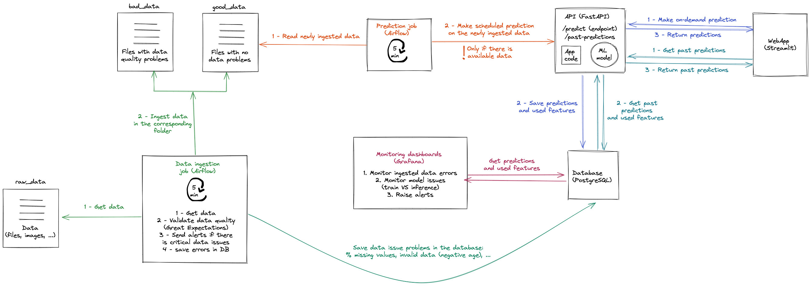

# Data Science in Production

## Project Architecture
<p align="center">
    
</p>

## Table of Contents

1. [About this README](#about-this-readme)
2. [Overview](#overview)
3. [Prerequisites](#prerequisites)
4. [Installation Steps](#installation-steps)
5. [Setting Up PostgreSQL](#setting-up-postgresql)
6. [Configure Airflow](#configure-airflow)
7. [Start Airflow](#start-airflow)
8. [Run FastAPI](#run-fastapi)
9. [Run Streamlit](#run-streamlit)
10. [Set Up Great Expectations](#set-up-great-expectations)
11. [Using Checkpoints in Great Expectations](#using-checkpoints-in-great-expectations)
12. [Technologies Used](#technologies-used)
13. [Collaborators](#collaborators)
14. [Notes](#notes)

## About this README
This README outlines the steps to set up the project, install dependencies, and run Airflow, FastAPI, Streamlit, and Great Expectations.

## Overview

This project utilizes Airflow for orchestration, FastAPI for serving predictions, Streamlit for the web interface, and Great Expectations for data validation. It connects to a PostgreSQL database to manage data.

## Prerequisites

Make sure you have the following installed:

- Python 3.9 or later
- PostgreSQL
- Homebrew (for Mac users)

## Installation Steps

1. **Clone the Repository**
    ```bash
    git clone <your-repo-url>
    cd <your-repo-folder>
    ```

2. **Create a Virtual Environment**
    ```bash
    conda create --name myenv python=3.9
    ```

3. **Activate the Conda Environment**
    ```bash
    conda activate myenv
    ```

4. **Install Required Packages**
    ```bash
    pip install -r requirements.txt
    ```

## Setting Up PostgreSQL

1. **Start PostgreSQL Service** If you installed PostgreSQL via Homebrew, run:
    ```cmd
    brew services start postgresql
    ```
2. **Log into PostgreSQL**
    ```bash
    psql -U postgres # run this line in your terminal
    ```

3. **Create a PostgreSQL Database**
    ```SQL
    CREATE DATABASE <your_database_name>;
    CREATE USER <user_name> WITH PASSWORD '<your_password>';
    GRANT ALL PRIVILEGES ON DATABASE <your_database_name> TO <user_name>;
    ```
4. **Exit PostgreSQL**
    ```bash
    \q
    ```

5. **Login to PostgreSQL with new User**
    ```bash
    psql -U <user_name> -d <your_database_name>
    ```

## Configure Airflow

1. **Export the Airflow Home Directory**
    ```bash
    export AIRFLOW_HOME=${PWD}/airflow
    ```
2. **Initialize the Airflow database**
    ```bash
    airflow db init
    ```

3. **Create Airflow User**
    ```bash
    airflow users create \
    --username admin \
    --firstname admin \
    --lastname admin \
    --role Admin \
    --email admin@admin.com \
    --password admin
    ```

## Start Airflow

Don't forget to always `export AIRFLOW_HOME=${PWD}/airflow`
1. **Start Scheduler & Server**
    ```bash
    airflow scheduler &
    airflow webserver --port 8080
    ```
    **or**
    
    ```bash
    airflow standalone
    ```
    *You can access the Airflow UI at* `http://localhost:8080`.

## Run FastAPI

1. **Navigate to the FastAPI directory**
    ```bash
    cd code/app
    ```
2. **Run the FastAPI application**
    ```bash
    uvicorn main:app --reload  # Adjust main:app as necessary
    ```
    **or**

    ```bash
    fastapi dev main.py
    ```
    *You can access the FastAPI UI at* `http://localhost:8000/docs`.

## Run Streamlit

1. **Navigate to the Streamlit directory**
    ```bash
    cd code/app  # Adjust if necessary
    ```
2. **Run the Streamlit application**
    ```bash
    streamlit run your_streamlit_file.py  # Replace with your Streamlit file name
    ```
    *You can access the Streamlit app at* `http://localhost:8501.`

## Set Up Great Expectations

1. **Initialize Great Expectations**
    Navigate to your project directory and run:
    ```bash
    great_expectations init
    ```
    This command will create a `great_expectations` directory in your project.

2. **Configure Your Data Source**
    You can add your data source in the `great_expectations.yml` file located in the `great_expectations` directory. You can also run:
    ```bash
    great_expectations datasource new
    ```
    Follow the prompts to set up your data source.

3. **Create Expectations**
    To create expectations for your data, you can run:
    ```bash
    great_expectations suite new
    ```
    Follow the prompts to create a new expectation suite.

4. **Validate Your Data**
    To validate your data against the expectations, you can run:
    ```bash
    great_expectations suite validate <your_suite_name>
    ```
    Replace `<your_suite_name>` with the name of the suite you created.

5. **Save Validation Results**
    The results of the validation can be saved to your PostgreSQL database using your existing Airflow DAG setup.

## Using Checkpoints in Great Expectations

1. **Create a Checkpoint**
    You can create a checkpoint to run validations against a specific expectation suite. Run the following command:
    ```bash
    great_expectations checkpoint new
    ```
    Follow the prompts to name your checkpoint and link it to your expectation suite.

2. **Run a Checkpoint**
    To execute a checkpoint, use the following command:
    ```bash
    great_expectations checkpoint run <your_checkpoint_name>
    ```
    Replace `<your_checkpoint_name>` with the name of the checkpoint you created. This will run the validations and save the results.

3. **Build Documentation**
    After running your checkpoints and validation, you can build the documentation for Great Expectations with the following command:
    ```bash
    great_expectations docs build
    ```
    This will generate documentation for your expectations, which can be useful for understanding the validation process and results.

4. **View Checkpoint Results**
    The results of the checkpoint run will be stored in the `great_expectations/uncommitted/` directory, allowing you to review validation outcomes and any potential issues.


## Technologies Used


## Collaborators
<center>
<a href="https://github.com/semmaa" target="_blank">
 
</a>
<a href="https://github.com/joekhater" target="_blank">
 
</a>
<a href="https://github.com/Sa7800111" target="_blank">

</a>
</center>

### Notes:
- Replace `<your-repo-url>` with the actual URL of your repository.
- Replace `<your_database_name>`, `user_name`, and `<your_password>` with the desired database name and password.
- Update any paths as needed to fit your project's structure.
